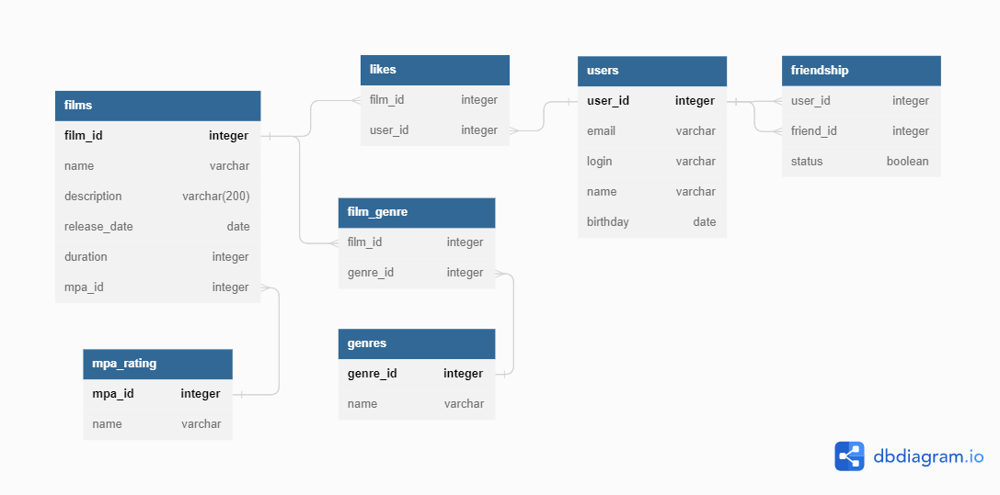

# java-filmorate

### ER-диаграмма


[В редакторе](https://dbdiagram.io/d/6447daa26b319470512b77c5)


### База данных

**films**

Содержит информацию о фильмах.

Таблица состоит из полей:

*film_id* — *первичный ключ* — идентификатор фильма;

*name* — название фильма;

*description* — описание фильма;

*release_date* — дата релиза фильма;

*duration* — продолжительность фильма в минутах;

*mpa_id* — рейтинг Ассоциации кинокомпаний, определяет возрастное ограничение для фильма.

**mpa_rating**

Содержит информацию о рейтинге Ассоциации кинокомпаний, определяющем возрастное ограничение для фильма.

Таблица состоит из полей:

*mpa_id* — *первичный ключ* — идентификатор рейтинга;

*name* — название рейтинга, могут быть следующие:
+ G — у фильма нет возрастных ограничений,
+ PG — детям рекомендуется смотреть фильм с родителями,
+ PG-13 — детям до 13 лет просмотр не желателен,
+ R — лицам до 17 лет просматривать фильм можно только в присутствии взрослого,
+ NC-17 — лицам до 18 лет просмотр запрещён.

**film_genre**

Содержит информацию о жанрах фильмов из таблицы films

Таблица состоит из полей:

*film_id* — идентификатор фильма;

*genre_id* — идентификатор жанра.

**genres**

Содержит информацию о жанрах фильмов.

Таблица состоит из полей:

*genre_id* — *первичный ключ* — идентификатор жанра;

*name* — название жанра.

**likes**

Содержит информацию о лайках, которые пользователи ставят фильмам.

Таблица состоит из полей:

*film_id* — идентификатор фильма;

*user_id* — идентификатор пользователя.

**users**

Содержит информацию о пользователях.

Таблица состоит из полей:

*user_id* — *первичный ключ* — идентификатор пользователя;

*email* — электронный адрес пользователя;

*login* — логин пользователя;

*name* — имя пользователя;

*birthday* — день рождения пользователя.

**friendship**
Содержит информацию о дружбе пользователей.

*user_id* — идентификатор пользователя;

*friend_id* — идентификатор пользователя-друга;

*status* — статус добавления пользователей в друзья:

+ 'unconfirmed' — «неподтверждённая» — когда один пользователь отправил запрос на добавление другого пользователя в друзья;
+ 'confirmed' — «подтверждённая» — когда второй пользователь согласился на добавление.

### Примеры запросов

**Запрос всех фильмов**
```
SELECT *
FROM films;
```

**Запрос пяти самых популярных фильмов**
```
SELECT * 
FROM films 
WHERE film_id IN(SELECT film_id 
FROM likes 
GROUP BY film_id 
ORDER BY COUNT(user_id) DESC 
LIMIT 5);
```

**Запрос информации о фильме с id=2**
```
SELECT name,
description, 
duration
FROM films 
WHERE film_id=2;
```

**Запрос общего количества фильмов с продолжительностью больше 100 минут и рейтингом с id=1**
```
SELECT COUNT(film_id) 
FROM films 
WHERE duration > 100 AND mpa_id=1;
```
**Запрос информации о фильмах продолжительностью больше 100 минут и рейтингом id=1**
```
SELECT film_id, name, duration 
FROM films 
WHERE duration > 100 AND mpa_id=1;
```
**Запрос поиска фильмов определенного жанра**
```
SELECT film_id, name, description 
FROM films WHERE film_id IN(SELECT film_id 
FROM film_genre 
WHERE genre_id IN(SELECT genre_id 
FROM genres WHERE name = 'melodrama'));
```
**Запрос поиска всех пользователей**
```
SELECT * 
FROM users;
```
**Запрос пользователей с определенным годом рождения**
```
SELECT user_id, login, name 
FROM users 
WHERE EXTRACT(YEAR FROM CAST(birthday AS date)) >= '1990';
```
**Запрос пользователей с электронной почтой на определенном домене**
```
SELECT user_id, email, login, name 
FROM users
WHERE email LIKE '%@yandex.ru%';
```
**Запрос друзей пользователя с определенным id**
```
SELECT user_id, name 
FROM users 
WHERE user_id IN (SELECT friend_id 
FROM friendship 
WHERE user_id=3 AND status='yes');
```
**Запрос общих друзей**

```
SELECT DISTINCT *
FROM users
WHERE user_id IN (SELECT friend_id
     FROM friendship
     WHERE user_id = 2
     AND status = 'yes'
     AND friend_id NOT IN (2, 3)
     UNION SELECT user_id
     FROM friendship
     WHERE friend_id = 3
     AND status = 'yes'
     AND user_id NOT IN (2, 3))
UNION SELECT DISTINCT *
FROM users
WHERE user_id IN
    (SELECT friend_id
     FROM friendship
     WHERE user_id = 3
       AND status = 'yes'
       AND friend_id NOT IN (2, 3)
     UNION SELECT user_id
     FROM friendship
     WHERE friend_id = 2
       AND status = 'yes'
       AND user_id NOT IN (2, 3));
```